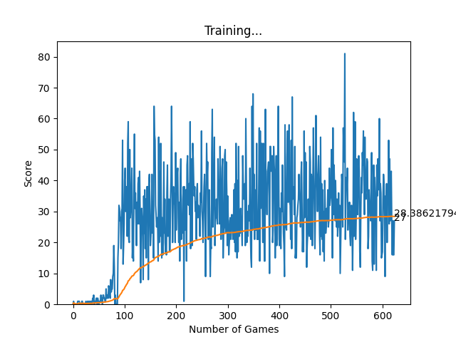

# SnakeAI
Python Snake Game AI with DQN

The project implements a Deep Q-Learning agent that learns to play the Snake game by interacting with the environment, storing experiences, and training a neural network to predict the best moves. It balances exploration and exploitation, updates its strategy using rewards and future predictions, and improves over time through repeated gameplay and training.

What Could Be Improved
Enable the snake to wrap around the walls instead of dying on collision.

Add collision detection for specific points in the game.

Enhance the state representation to include “two steps ahead” information, allowing the agent to better predict and avoid self-collisions.
